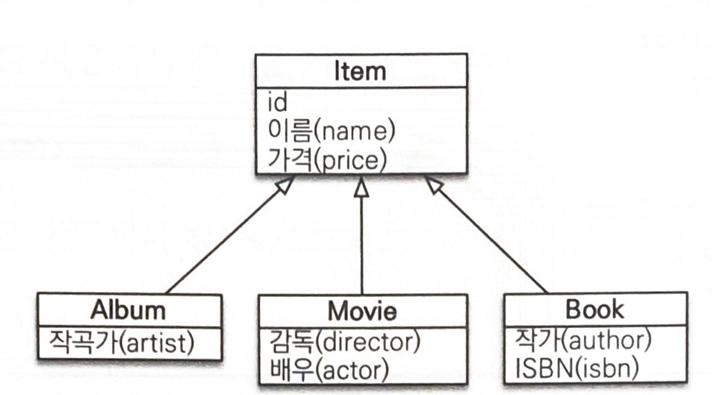
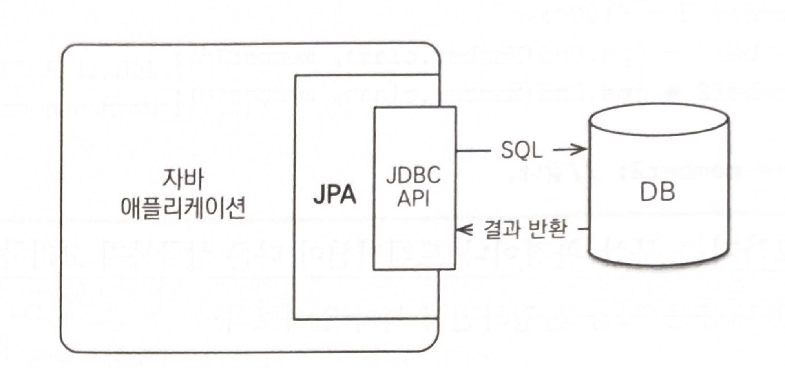
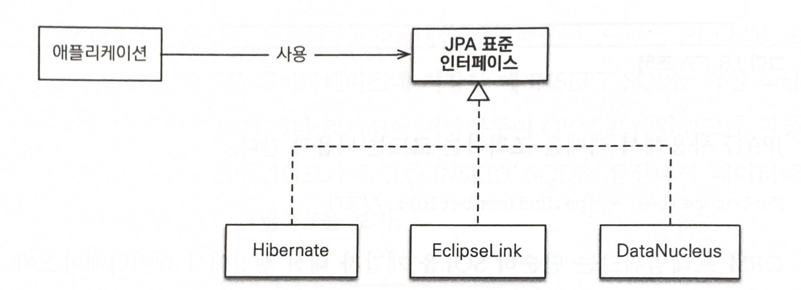

# 1장 JPA 소개

초기 애플리케이션 개발에서는 JDBC API를 직접 사용했었다. 

하지만 이는 애플리케이션의 비즈니스 로직보다 SQL과 JDBC API 코드를 작성하는데 더 많은 시간이 필요했다.

시간이 지나고 아이바티스(지금의 마이바티스)나 스프링의 JdbcTemplate 같은 SQL Mapper를 사용하면서 JDBC API 사용 코드를 많이 줄일 수 있었다.

하지만 여전히 SQL을 반복적으로 작성해야 했고 이는 비생산적이었다.

“왜 실무에서 테이블 설계는 다들 열심히 하면서 제대로 된 객체 모델링은 하지 않을까?”

“왜 객체지향의 장점을 포기하고 객체를 단순히 테이블에 맞추어 데이터 전달 역할만 하도록 개발할까?”

하지만 객체 모델링을 적용하더라도 객체 모델링을 SQL로 풀어내는 데 너무 많은 코드와 노력이 필요했고, 객체 모델은 점점 데이터 중심의 모델로 변해갔다.

JPA(자바 진영의 ORM 기술 표준)는 지루하고 반복적인 CRUD SQL을 알아서 처리해줄 뿐만 아니라 객체 모델링과 관계형 데이터베이스 사이의 차이점도 해결해주었다.

### JPA 장점

- CRUD SQL을 작성할 필요가 없고 조회 결과를 객체로 매핑하는 작업도 대부분 자동으로 처리해준다.
- 성능에 대한 부분도 JPA 네이티브 SQL 기능을 사용하거나 DB 쿼리 힌트도 사용할 수 있다.
- JPA를 통해 애플리케이션을 SQL이 아닌 객체 중심으로 개발하여 생산성과 유지보수가 좋아지고 테스트를 작성하기 편리해진다.
- 데이터베이스에 종속되지 않기 때문에 DB를 바꾸더라도 많은 코드를 바꾸지 않아도 된다.

귀찮은 문제들은 이제 JPA에게 맡기고 더 좋은 객체 모델링과 더 많은 테스트를 작성하는 데 우리의 시간을 보내자. 개발자는 SQL 매퍼가 아니다.

# 1.1 SQL을 직접 다룰 때 발생하는 문제점

### 회원 등록 기능

```java
public class MemberDAO{
		public Member find(String memberId){ ...}
		public void save(Member member){ ...} // 추가
}

```

1. 회원 등록용 SQL을 작성한다.

```java
String sql = "INSERT INTO MEMBER(MEMBER_ID, NAME) VALUES(?, ?)";
```

1. 회원 객체의 값을 꺼내서 등록 SQL에 전달한다.

```java
pstmt.setString(1, member.getMemberId());
pstmt.setString(2, member.getName());
```

1. JDBC API를 사용해서 SQL을 실행한다.

```java
pstmt.executeUpdate(sql);
```

기능을 추가할 때마다 위와 같은 작업을 반복해야한다.

회원 객체를 데이터베이스가 아닌 자바 컬렉션에 보관한다면 어떨까?

```java
list.add(member);
```

하지만 데이터베이스에는 객체를 직접 담을 수 없기 때문에 개발자가 중간에서 변환 작업을 작성해주어야 한다.

테이블마다 이런 비슷한 일을 반복해야 하는데, 개발하려는 애플리케이션에서 사용하는 데이터베이스 테이블이 100개라면 무수히 많은 SQL을 작성해야 하고 이런 비슷한 일을 100번은 더 반복해야 한다.

## 1.1.2 SQL에 의존적인 개발

그런데 갑자기 회원의 연락처도 함께 저장해달라는 요구사항이 추가되었다.

개발을 하면서 SQL에 의존적으로 개발하다보니 DAO를 열어서 SQL을 확인하지 않고는 어떤 버그가 발생하더라도 원인을 찾기 힘들다.

Member 객체가 연관된 Team 객체를 사용할 수 있을지 없을지는 전적으로 사용하는 SQL에 달려 있다.

이런 방식의 가장 큰 문제점은 데이터 접근 계층을 사용해서 SQL을 숨겨도 어쩔 수 없이 DAO를 열어서 어떤 SQL이 실행되는지 확인해야 한다는 점이다.

### SQL에 의존할 때의 문제점

Member나 Team처럼 비즈니스 요구사항을 모델링한 객체를 엔티티라 하는데, 지금처럼 SQL에 모든 것을 의존하는 상황에서는 개발자들이 엔티티를 신뢰하고 사용할 수 없다.

대신에 DAO를 열어서 어떤 SQL이 실행되고 어떤 객체들이 함께 조회되는지 일일이 확인해야 한다.

이것은 진정한 의미의 계층 분할이 아니다.

물리적으로 SQL과 JDBC API를 데이터 접근 계층에 숨기는 데 성공했을지는 몰라도 논리적으로는 엔티티와 아주 강한 의존관계를 가지고 있다.

이런 강한 의존관계 때문에 회원을 조회할 때는 문론이고 회원 객체에 필드를 하나 추가할 때도 DAO의 CRUD 코드와 SQL 대부분을 변경해야 하는 문제가 발생한다.

**요약**

- 진정한 의미의 계층 분할이 어렵다.
- 엔티티를 신뢰할 수 없다.
- SQL에 의존적인 개발을 피하기 어렵다.

## 1.1.3 JPA와 문제 해결

JPA를 사용하면 객체를 데이터베이스에 저장하고 관리할 때, 개발자가 직접 SQL을 작성하는 것이 아니라 JPA가 제공하는 API를 사용하면 된다.

그러면 개발자 대신에 적절한 SQL을 생성해서 데이터베이스에 전달한다.

### 저장 (Create)

```java
jpa.persist(member); // 저장
```

이 메서드를 호출하면 JPA가 객체와 매핑정보를 보고 적절한 INSERT SQL을 생성해서 데이터베이스에 전달한다.

### 연관된 객체 조회

```java
Member member = jpa.find(Member.class, memberId);
Team team = member.getTeam(); // 연관된 객체 조회
```

JPA는 연관된 객체를 사용하는 시점에 적절한 SELECT SQL을 실행한다.

따라서 JPA를 사용하면 연관된 객체를 마음껏 조회할 수 있다.

# 1.2 패러다임의 불일치

객체지향 프로그래밍은 추상화, 캡슐화, 정보은닉, 상속, 다형성 등 시스템의 복잡성을 제어할 수 있는 다양한 장치들을 제공한다.

그래서 현대의 복잡한 애플리케이션은 대부분 객체지향 언어로 개발한다.

객체가 단순하면 객체의 모든 속성 값을 꺼내서 파일이나 데이터베이스에 저장하면 되지만, 부모 객체를 상속받았거나, 다른 객체를 참조하고 있다면 객체의 상태를 저장하기가 쉽지 않다.

예를 들어 회원 객체를 저장해야 하는데 회원 객체가 팀 객체를 참조하고 있다면, 회원 객체를 저장할 때 팀 객체를 잃어버리는 문제가 발생한다.

### 패러다임 불일치

객체와 관계형 데이터베이스는 지향하는 목적이 다르므로 둘의 기능과 표현 방법도 다르다.

이것을 객체와 관계형 데이터베이스의 패러다임 불일치 문제라 한다.

따라서 객체 구조를 테이블 구조에 저장하는 데는 한계가 있다.

애플리케이션은 자바라는 객체지향 언어로 개발하고 데이터는 관계형 데이터베이스에 저장해야 한다면, 패러다임 불일치 문제를 개발자가 중간에서 해결해야한다.

문제는 이런 객체와 관계형 데이터베이스 사이의 패러다임 불일치 문제를 해결하는 데 너무 많은 시간과 코드를 소비하는 데 있다.

## 1.2.1 상속

객체는 상속이라는 기능을 가지고 있지만 테이블은 상속이라는 기능이 없다. (일부 데이터베이스는 상속 기능을 지원하지만 객체의 상속과는 약간 다르다.)


객체 상속 모델

그나마 데이터베이스 모델링에서 이야기하는 슈퍼타입 서브타입 관계를 사용하면 객체 상속과 가장 유사한 형태로 테이블을 설계할 수 있다.


테이블 모델

JDBC API를 사용해서 이 코드를 완성하려면 부모 객체에서 부모 데이터만 꺼내서 ITEM 용 INSERT SQL을 작성하고 자식 객체에서 자식 데이터만 꺼내서 ALBUM용 INSERT SQL을 작성해야 하는데, 작성해야 할 코드량이 만만치 않다.

이런 과정이 모두 패러다임의 불일치를 해결하려고 소모하는 비용이다.

만약 해당 객체들을 데이터베이스가 아닌 자바 컬렉션에 보관한다면 다음 같이 부모 자식이나 타입에 대한 고민 없이 해당 컬렉션을 그냥 사용하면 된다.

```java
list.add(album);
list.add(movie);

Album album = list.get(albumId);
```

### JPA와 상속

JPA는 상속과 관련된 패러다임의 불일치 문제를 개발자 대신 해결해준다.

개발자는 마치 자바 컬렉션에 객체를 저장하듯이 JPA에게 객체를 저장하면 된다.

**JPA를 사용해서 Item을 상속한 Album 객체를 저장**

```java
jpa.persist(album);
```

JPA는 다음 SQL을 실행해서 객체를 ITEM, ALBUM 두 테이블에 나누어 저장한다.

```sql
INSERT INTO ITEM ...
INSERT INTO ALBUM ...
```

다음으로 Album 객체를 조회해보자.

```java
String albumId = "id100";
Album album = jpa.find(Album.class, albumId);
```

JPA는 ITEM과 ALBUM 두 테이블을 조인해서 필요한 데이터를 조회하고 그 결과를 반환한다.

```sql
SELECT I.*, A.*
FROM ITEM I JOIN ALBUM A
ON I.ITEM_ID = A.ITEM_ID
```

## 1.2.2 연관관계

객체는 참조를 사용해서 다른 객체와 연관관계를 가지고 참조에 접근해서 연관된 객체를 조회한다.

반면에 테이블은 외래 키를 사용해서 다른 테이블과 연관관계를 가지고 조인을 사용해서 연관된 테이블을 조회한다.

참조를 사용하는 객체와 외래 키를 사용하는 관계형 데이터베이스 사이의 패러다임 불일치는 객체지향 모델링을 거의 포기하게 만들 정도록 극복하기 어렵다.


객체연관관계

Member 객체는 [Member.team](http://Member.team) 필드에 Team 객체의 참조를 보관해서 Team 객체와 관계를 맺는다.

따라서 이 참조 필드에 접근하면 Member와 연관된 Team을 조회할 수 있다.

```java
class Member{
		Team team;
		...
		Team getTeam(){return this.team;}

}
class Team{
		...
}
```

MEMBER 테이블은 MEMBER.TEAM_ID 외래 키 컬럼을 사용해서 TEAM 테이블과 관계를 맺는다.

이 외래 키를 사용해서 MEMBER 테이블과 TEAM 테이블을 조인하면 MEMBER 테이블과 연관된 TEAM 테이블을 조회할 수 있다.

```sql
SELECT M.*, T.*
FROM MEMBER M JOIN TEAM T
ON M.TEAM_ID = T.TEAM_ID
```

조금 어려운 문제도 있는데, 객체는 참조가 있는 방향으로만 조회할 수 있다.

방금 예에서 member.getTeam()은 가능하지만 반대 방향인 team.getMember()는 참조가 없으므로 불가능하다.

반면에 테이블은 외래 키 하나로 MEMBER JOIN TEAM도 가능하지만 TEAM JOIN MEMBER도 가능하다.

### JPA와 연관관계

JPA는 연관관계와 관련된 패러다임의 불일치 문제를 해결해준다.

```java
member.setTeam(team);
jpa.persist(member);
```

개발자는 회원과 팀의 관계를 설정하고 회원 객체를 저장하면 된다.

JPA는 team의 참조를 외래 키로 변환해서 적절한 INSERT SQL을 데이터베이스에 전달한다.

객체를 조회할 때 외래 키를 참조로 변환하는 일도 JPA가 처리해준다.

```java
Member member = jpa.find(Member.class, memberId);
Team team = member.getTeam();
```

지금까지 설명한 문제들은 SQL을 직접 다루어도 열심히 코드만 작성하면 어느정도 극복할 수 있는 문제들이었다.

연관관계와 관련해서 극복하기 어려운 패러다임의 불일치 문제를 알아보자.

## 1.2.3 객체 그래프 탐색

객체에서 회원이 소속된 팀을 조회할 때는 다음처럼 참조를 사용해서 연관된 팀을 찾으면 되는데, 이것을 객체 그래프 탐색이라고 한다.

```java
Team team = member.getTeam();
```

객체 연관관계가 다음과 같이 설계되어 있다고 가정해보자.


객체그래프  

다음은 객체 그래프를 탐색하는 코드다.

```java
member.getOrder().getOrderItem() .. // 자유로운 객체 그래프 탐색
```

객체는 마음껏 객체 그래프를 탐색할 수 있어야 한다.

그런데 마음껏 객체 그래프를 탐색할 수 있을까?

```sql
SELECT M.*, T.*
FROM MEMBER M JOIN TEAM T
ON M.TEAM_ID = T.TEAM_ID
```

만약 위와 같은 SQL을 실행해서 회원과 팀에 대한 데이터만 조회했다면 member.getTeam()은 성공하지만 다음처럼 다른 객체 그래프는 데이터가 없으므로 탐색할 수 없다.

```java
member.getOrder(); // null
```

`SQL을 직접 다루면 처음 실행하는 SQL에 따라 객체 그래프를 어디까지 탐색할 수 있는지 정해진다.`

이것은 객체지향 개발자에겐 너무 큰 제약이다.

왜냐하면 비조니스로직에 따라 사용하는 객체 그래프가 다른데 언제 끊어질지 모를 객체 그래프를 함부로 탐색할 수는 없기 때문이다.

```java
class MemberService{
		...
		public void process(){
				Member member = memberDAO.find(memberId);
				member.getTeam(); // member -> team 객체 그래프 탐색이 가능한가?
				member.getOrder().getDelivery(); // ???
		}
}
```

MemberService는 memberDAO를 통해서 member 객체를 조회했지만, 이 객체와 연관된 Team, Order, Delivery 방향으로 객체 그래프를 탐색할 수 있을지 없을지는 이 코드만 보고는 전혀 예측할 수 없다.

결국 어디까지 객체 그래프 탐색이 가능한지 알아보려면 데이터 접근 계층인 DAO를 열어서 SQL을 직접 확인해야 한다.

이것은 SQL에 의존적인 개발에서도 이야기 했듯이 엔티티가 SQL에 논리적으로 종속되어서 발생하는 문제이다.

### JPA와 객체 그래프 탐색

JPA를 사용하면 객체 그래프를 마음껏 탐색할 수 있다.

```java
member.getOrder().getOrderItem() ... // 자유로운 객체 그래프 탐색
```

JPA는 연관된 객체를 사용하는 시점에 적절한 SELECT SQL을 실행한다.

따라서 JPA를 사용하면 연관된 객체를 신뢰하고 마음껏 조회할 수 있다.

이 기능은 실제 객체를 사용하는 시점까지 데이터베이스 조회를 미룬다고 해서 `지연 로딩` 이라 한다.

```java
// 처음 조회 시점에 SELECT MEMBER SQL
Member member = jpa.find(Member.class, memberId);

Order order = member.getOrder();
order.getOrderDate(); // Order를 사용하는 시점에 SELECT ORDER SQL
```

여기서 마지막 줄의 order.getOrderDate() 같이 실제 Order 객체를 사용하는 시점에 JPA는 데이터베이스에서 ORDER 테이블을 조회한다.

Member를 사용할 때마다 Order를 함께 사용하면, 이렇게 한 테이블씩 조회하는 것보다는 Member를 조회하는 시점에 SQL 조인을 사용해서 Member와 Order를 함께 조회하는 것이 효과적이다.

JPA는 연관된 객체를 즉시 함께 조회할지 아니면 실제 사용되는 시점에 지연해서 조회할지를 간단한 설정으로 정의할 수 있다.

## 1.2.4 비교

데이터베이스는 기본 키의 값으로 각 로우를 구분한다.

반면에 객체는 동일성 비교와 동등성 비교라는 두 가지 비교 방법이 있다.

- 동일성 비교는 == 비교 : 객체 인스턴스의 주소 값을 비교
- 동등성 비교는 equals() 비교 : 객체 내부의 값을 비교

따라서 테이블의 로우를 구분하는 방법과 객체를 구분하는 방법에는 차이가 있다.

```java
class MemberDAO{
		public Member getMember(String memberId){
				String sql = "SELECT * FROM MEMBER WHERE MEMBER_ID = ?";
				...
				// JDBC API, SQL 실행
		}
}
```

```java
String memberId = "100";
Member member1 = memberDAO.getMember(memberId);
Member member2 = memberDAO.getMember(memberId);

member1 == member2; // 다르다.
```

위의 예제를 보면 기본 키 값이 같은 회원 객체를 두 번 조회했다.

그런데 둘을 동일성(==) 비교하면 false가 반환된다.

왜냐하면 member1과 member2는 같은 데이터베이스 로우에서 조회했지만, 객체 측면에서 볼 때 둘은 다른 인스턴스기 때문이다.

따라서 데이터베이스의 같은 로우를 조회했지만 객체의 동일성 비교에는 실패한다.

만약 객체를 컬렉션에 보관했다면 다음과 같이 동일성 비교에 성공했을 것이다.

```java
Member member1 = list.get(0);
Member member2 = list.get(0);

member1 == member2; // 같다.
```

### JPA와 비교

JPA는 같은 트랜잭션일 때 같은 객체가 조회되는 것을 보장한다.

그러므로 다음 코드에서 member1과 member2는 동일성 비교에 성공한다.

```java
String memberId = "100";
Member member1 = jpa.find(Member.class, memberId);
Member member2 = jpa.find(Member.class, memberId);

member1 == member2; // 같다.
```

# 1.3 JPA란 무엇인가?

JPA (Java Persistence API)는 자바 진영의 ORM 기술 표준이다.

애플리케이션과 JDBC 사이에서 동작한다.



그렇다면 ORM이란 무엇일까?

ORM 프레임워크는 객체와 테이블을 매핑해서 패러다임의 불일치 문제를 개발자 대신 해결해준다.


ORM 프레임워크를 사용하면 객체를 데이터베이스에 저장할 때 INSERT SQL을 직접 작성하는 것이 아니라 객체를 마치 자바 컬렉션에 저장하듯이 ORM 프레임워크에 저장하면 된다.

그러면 ORM 프레임워크가 적절한 INSERT SQL을 생성해서 데이터베이스에 객체를 저장해준다.


조회할 때도 JPA를 통해 직접 조회하면 된다.

ORM 프레임워크는 단순히 SQL을 개발자 대신 생성해서 데이터베이스에 전달해주는 것뿐만 아니라 앞서 이야기한 다양한 패러다임의 불일치 문제들도 해결해준다.

따라서 객체 측면에서는 정교한 객체 모델링을 할 수 있고 관계형 데이터베이스는 데이터베이스에 맞도록 모델링하면 된다.

그리고 둘을 어떻게 매핑해야 하는지 매핑 방법만 ORM 프레임워크에게 알려주면된다.

덕분에 개발자는 데이터 중심인 관계형 데이터베이스를 사용해도 객체지향 애플리케이션 개발에 집중할 수 있다.

## 1.3.1 JPA 소개

과거 자바 진영은 엔터프라이즈 자바 빈즈라는 기술 표준을 만들었는데 그 안에는 엔티티 빈이라는 ORM 기술도 포함되어 있었다.

하지만 너무 복잡하고 기술 성숙도도 떨어졌으며 자바 엔터프라이즈 애플리케이션 서버에서만 동작했다.

이때 하이버네이트라는 오픈소스 ORM 프레임워크가 등장했는데 EJB의 ORM 기술과 비교해서 가볍고 실용적인 데다 기술 성숙도도 높았다.

또한 자바 엔터프라이즈 애플리케이션 서버 없이도 동작해서 많은 개발자가 사용하기 시작했다.

결국 EJB 3.0에서 하이버네이트를 기반으로 새로운 자바 ORM 기술 표준이 만들어졌는데 이것이 바로 JPA이다.



## 1.3.2 왜 JPA를 사용해야 하는가?

### 생산성

- JPA를 사용하면 자바 컬렉션에 객체를 저장하듯이 JPA에게 저장할 객체를 전달하면 된다.
- 더 나아가서 JPA는 CREATE TABLE 같은 DDL 문을 자동으로 생성해주는 기능도 있다.
- 이런 기능들을 사용하면 데이터베이스 설계 중심의 패러다임을 객체 설계 중심으로 역전시킬 수 있다.

### 유지보수

- SQL에 의존적인 개발에서도 이야기했듯이 SQL을 직접 다루면 엔티티에 필드를 하나만 추가해도 관련된 등록, 수정 조회 SQL과 결과를 매핑하기 위한 JDBC API를 모두 변경해야 했다.
- 반면에 JPA를 사용하면 이런 과정을 JPA가 대신 처리해주므로 필드를 추가하거나 삭제해도 수정해야 할 코드가 줄어든다.
- 따라서 개발자가 작성해야 했던 SQL과 JDBC API 코드를 JPA가 대신 처리해주므로 유지보수해야 하는 코드 수가 줄어든다.
- 또한 JPA가 패러다임의 불일치 문제를 해결해주므로 객체지향 언어가 가진 장점들을 활용해서 유연하고 유지보수하기 좋은 도메인 모델을 편리하게 설계할 수 있다.

### 패러다임의 불일치 해결

- JPA는 상속, 연관관계, 객체 그래프 탐색, 비교하기와 같은 패러다임의 불일치 문제를 해결해준다.

### 성능

- JPA는 애플리케이션과 데이터베이스 사이에서 다양한 성능 최적화 기회를 제공한다.
- 이렇게 애플리케이션과 데이터베이스 사이에 계층이 하나 더 있으면 최적화 관점에서 시도해 볼 수 있는 것들이 많다.

### 데이터 접근 추상화와 벤더 독립성

- 관계형 데이터베이스는 같은 기능도 벤더마다 사용법이 다른 경우가 많다.
- 단적인 예로 페이징 처리는 데이터베이스마다 달라서 사용법을 각각 배워야 한다.
- 결국 애플리케이션은 처음 선택한 데이터베이스 기술에 종속되고 다른 데이터베이스로 변경하기는 매우 어렵다.
- JPA는 애플리케이션과 데이터베이스 사이에 추상화된 데이터 접근 계층을 제공해서 애플리케이션이 특정 데이터베이스 기술에 종속되지 않도록 한다.


# 1.4 정리

지금까지 SQL을 직접 다룰 때 발생하는 다양한 문제와 객체지향 언어와 관계형 데이터베이스 사이의 패러다임 불일치 문제를 설명했다.

그리고 JPA가 각 문제를 어떻게 해결하는지 알아보았다.

마지막으로 JPA가 무엇인지 설명하고 JPA의 장점들을 소개했다.